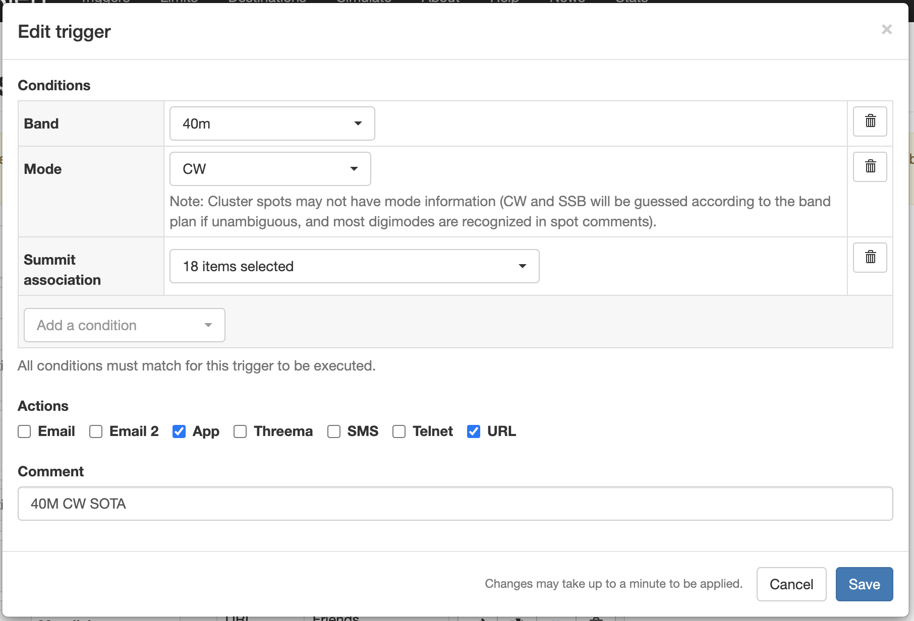
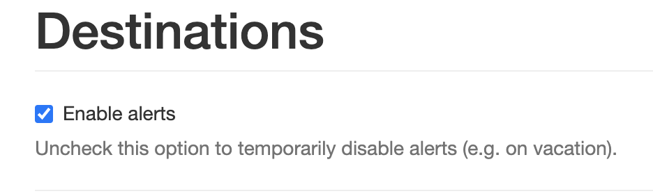
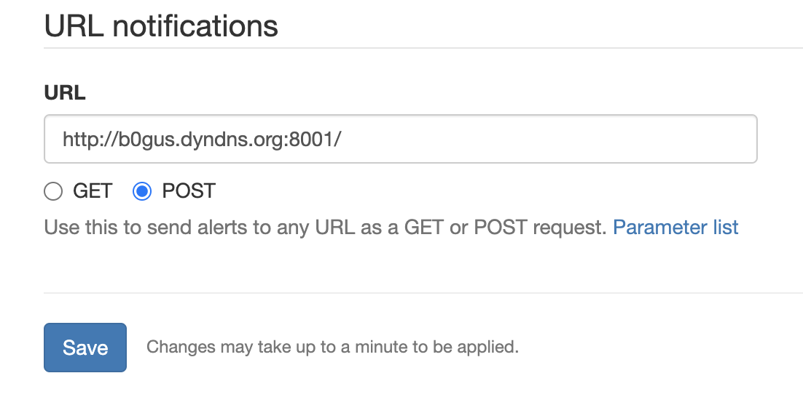

# HamAlert-Tuner

## Automatically Tunes Your Rig to HamAlert Notices

#### 

# NOTE THAT THIS DOCUMENTATION IS NOT YET COMPLETE - AT THIS STAGE, THIS CODE IS FOR PEOPLE WHO KNOW WHAT THEY'RE DOING WITH RADIOS, COMPUTERS, AND NETWORKING.


#### History and Rationale

HamAlert is probably my single favorite app on my smart phone. I can configure a set of criteria regarding transmissions I'm interested in, and HamAlert pings me on my phone whenever any of those criteria are met. I live in Colorado, and my personal interest is SOTA. I'm also learning CW. I configured HamAlert to let me know any time there is a SOTA activation using CW on in the State of Colorado on any band, as well as an activation on any of the states around me on bands I'm likely to hear the activator on. Every five to thirty minutes, my phone beeps out "S-O-T-A" in CW, and lets me know to tune my rig to the activator's frequency, and work on my CW skills.

Of course, HamAlert does much more than alert SOTA fans to SOTA Activations. You can create criteria to be alerted to most anything. POTA/WWFF and IOTA are other categories. You pick the areas and bands you care about, and it'll keep you informed. Or DX chasers can get an alert when that last contact they need shows up on Kiribati on 20m. Or it'll let you know whenever any of your friends turn up on CW, JS8Call, FT8, etc.

I work from home, and my ham gear sits on a desk next to my computer (work) equipment. So for a few weeks, every time HamAlert would signal an activation, I'd swivel my chair around, tune up the radio, and give it a go. I earned over five hundred SOTA points in about four weeks. And then it kind of... stopped. No good reason, it just got to be too much trouble to tune the rig and check for a signal each time when work was busy.

Fortunately, there was a relatively straightforward solution. While HamAlert is best known for the alerts they push to your phone, if you poke around their web page, it turns out there are many ways to deliver alerts aside from the app itself. It can email the alerts to you. It can text them to you. It can deliver them to your DX Cluster application via Telnet. And best of all, it can deliver the alerts encoded in JSON to via a REST GET or POST to any arbitrary web server. Bingo.

#### What it Does

The solution to this was to leverage the REST delivery, along with a bit of code, to automatically tune the radio every time an alert is delivered.

What happens is this:

1. I've chosen TCP port 8001 as the port hamalert-tuner listens on, and have forwarded that port in my router to the machine running hamalert-tuner.

2. I've created a public DNS name that points to my public home IP address.

3. I've configured HamAlert to deliver alerts to port 8001 to the DNS name I created.

4. An alert is generated by HamAlert and delivered as a JSON payload to a POST to the URL where hamalert-tuner is listening.

5. hamalert-tuner extracts and parses the JSON data, does a bit of sanity checking on it, and displays the relevant information on my screen about the new alert.

6. I have flrig running on the same machine as hamalert-tuner, and have configured it to talk to my IC-7300. The beauty of using flrig is that the software should work on any radio supported by flrig.

7. hamalert-tuner talks to flrig over xmlrpc, tunes my radio to the frequency in the alert, sets the mode (USB, LSB, CW, etc) to the required mode, initiates a tune (optional), and turns the volume up to the level I've specified.

8. For the next sixty seconds (configurable), the audio plays.

9. So long as the audio is not muted, the frequency and mode won't change, even if a new alert comes in.

10. - If I don't touch anything during that sixty seconds, the audio automatically mutes, and the software is ready to tune to the next alert.

11. If I've changed the audio level up or down in any way, the software will continue to ignore any new alerts, and will continue to monitor the frequency of the last received alert.

12. Once I've made my contact (or grown tired of listening to static), I mute the audio (ie, turn the AF Gain/Volume all the way back down), and the software is ready to respond to the next alert.

This requires several things:

- A free HamAlert account, and the knowledge to configure it.

- The knowledge and ability to port-forward with the equipment supplied by your ISP (out of scope for this README, but easily found with The Google).

- I DNS entry pointing at the public IP of your home router (again, out of scope for this README, but do a google search on "dyndns" to get started).

- Python3 and a recent build of flrig (do a google search on "python3 install your-operating-system"). This might or might not work with Python2. Python2 has been superceded by Python3, and is no longer supported, so if python2 works for you, good for you, but at some point in the near future, it'll break and you'll have to upgrade.

- Knowledge and cabling necessary to wire your computer up to your radio, and to configure flrig to properly control it (start with the flrig documentation). Note that you really do need a recent build of flrig. If you try to use older code without the needed functionality, python will puke and die. TO-DO: Figure out and document what version is new enough.

- A radio capable of being controlled by flrig. Frequency and mode control are mandatory. Volume control is a nice-to-have, but not required. Without it, you'll have to deal with the volume knob yourself. And you'll have to ^C (quit) out of hamalert-tuner while you're making your contact and the restart it when you're done so it doesn't change frequencies on you while you're talking.

#### How It Works

Once you've completed the bulleted items above and downloaded the code, you need to configure the software. To do this, edit the config.json file. By default, it will look something like this:

```json
{
    "debug": 0,
    "call": "B0GUS",
    "auto_tune": 1,
    "mute_level": 0,
    "listen_time": 60,
    "flrig_ip": "127.0.0.1",
    "flrig_port": 12345,
    "server_listen_ip": "0.0.0.0",
    "server_listen_port": 8001
}
```

First rule, don't get crazy and don't get sloppy, meaning don't change the capitalization or spelling of anything, and every single ":", ",", and "{}" is there for a reason. If you add, subtract, or move any of them, you'll break the file. Change only values on the right side of the ":" in each line, and preserve the quotes and commas (if present).

Here's what each line means:

- debug - Valid values are 0 (zero) and 1. 0 means "do not print debug data" and 1 means "print debug data". While you won't hurt anything by turning this on, it's primarily for my use as the developer.

- call - This is your ham radio callsign. If you don't have one, you can put the name of your favorite pet or favorite child here. If you choose to leave it empty, you must have at least the two double-quotes and comma.

- auto_tune - Valid values are 0 (zero) and 1. A 0 here means "do not attempt to trigger the radio auto-tune after a frequency change" and 1 means "attempt to auto-tune after a frequency change". Depending on what country you live in, an auto-tune probably legally requires you to identify, as must auto-tuners generate a transmission.

- mute_level - The audio level to set the AF Gain/Volume to for when the radio should be quiet. - (zero) is more than likely what you want here, but it's your choice.

- listen_time - An integer number of seconds to listen to a new alert before automatically muting (assuming the volume is not adjusted).

- flrig_ip - The IP address (or DNS name, if you have those on your home network) of your flrig instance. 99% of the time, this will be "127.0.0.1", meaning it's running on the same machine. But if you know what you're doing, you can remote-control flrig on another machine.

- flrig_port - The TCP port flrig is listening to. Default is 12345, so unless you've changed this in flrig, don't change this value.

- server_listen_ip - This allows you to specify the IP of a specific interface on the server you're running hamalert-tuner on for the REST server process to bind to. If that sentence did not mean anything to you, DO NOT CHANGE THIS VALUE. Default is "0.0.0.0", which means, "listen on all IP addresses configured on this machine".

- server_listen_port - This is the TCP port that the embedded REST server listens on. This value is important to know when you're setting up your port forwarding. While  it is by no means mandatory, the least confusing way of setting up port forwarding is to pick a port number that's not in use, and configure that port number on the "outside" of your router to forward to the same port number on the "inside" of your router. Said another way, determine the IP of the machine running hamalert-tuner (let's pretend it's 192.168.1.42). Set the port number to 8001 (the default). Now go configure port forwarding on your router to forward connections to TCP port 8001 on the "outside" to 192.168.1.42 TCP port 8001 on the "inside". Again, it's perfectly acceptable to do port translation and use different ports inside and outside, but it's less confusing to keep them the same if this isn't something you do every day.

Now let's configure HamAlert. You can do this within the app on your phone, but it's easier to do with your web browser. Just log into the hamalert.org web page with the same credentials you use in the app. Within the HamAlert app (or on their web page), for each "search" that you configure, you specify a method of delivery for results that match your criteria:



For any alerts you want your radio to automatically tune to, make sure you click the "URL" box. Obviously, you can also select any other desired delivery methods. I typicall also choose "App" so I can see the alerts on my phone.

Now choose "Destinations" on the HamAlert web page (or app), and first make sure the "Enable Alerts" checkbox is selected at the top of the page:



Now scroll down the very bottom of the page, and specify the DNS name and port of your hamalert-tuner server. Remember to specify the "http://" at the beginning, the ":8001/" at the end (or whatever port you chose to forward), and remember to click the radio box next to "POST" (if you leave it on the default "GET", it won't work):



When you're done, click "Save".

#### Run It

First, fire up flrig and make sure it's talking to your radio. If that's not working, nothing that follows will work, either. Now run the hamalert-tuner software. On FreeBSD, Linux, and Mac, you open a terminal window, cd to the directory where you downloaded the code and config file, and type "./hamalert.py". I've never tried this on Windows, but there's no reason it shouldn't work. You should be able to run it in a command window with either "python3 hamalert.py" or "python hamalert.py". Note that you MUST be in the directory that contains the hamalert.py script, and the config.json file MUST be in the same directory. In future versions of the code, I'll make this a little more flexible (ie, you can keep the config.json file in your homedir, for example).

If python complains about missing libraries, you can use pip3 to
install them (ie, "pip3 install name-of-missing-library"). Don't know
the exact method for doing this on Windows, but duckduckgo.com is your
friend...


73 and GL, Jeff/N0GQ
